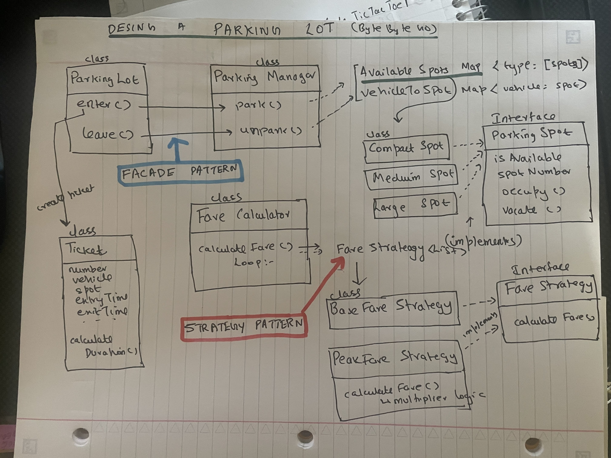

# Parking Lot System - Low Level Design

## Problem Statement

A Parking Lot consists of multiple Parking Levels. We will have 3 Parking levels.

A Parking Level consists of multiple Parking Spots. We will have 10 Parking Spots per SpotType.

A Parking Spot can be of different types - SpotType - MOTORCYCLE, COMPACT, LARGE

---

## Class Design

### Vehicle
We will associate the License Plate and Vehicle Type to the class. The VehicleType can be MOTORCYCLE, CAR or TRUCK.

### ParkingLot
Associate number of levels and ParkingLevels objects array

**Functions:**
- `parkVehicle(vehicle)` → For this loop through all the levels and see if we can park in any level. If a spot is found then assign the spot and create a ticket and return.
- `removeVehicle(ticket)` → Release the spot and calculate the cost
- `getAvailableSpots()` → Gets a count of all available spots in all levels

### ParkingLevel
Associate level number and ParkingSpots objects array

**Functions:**
- `parkVehicle(vehicle)` → Find an available spot and park. Loop through the spots array, remove out the not available spots, and get the spots that matches with the vehicle type. i.e these are the priority spot type mappings for each vehicle:
  - MOTORCYCLE - Can park in MOTORCYCLE, COMPACT, LARGE
  - CAR - Can park in COMPACT, LARGE
  - TRUCK - Can park in LARGE

### ParkingSpot
We will associate spotNumber, spotType, currentVehicle

**Functions:**
- `park(vehicle)` → Set the currentVehicle to the vehicle
- `isAvailable()` → Check if there is any currentVehicle
- `removeVehicle()` → Unsets the currentVehicle
- `canFitVehicle()` → util function to check if a spot can fit a given vehicle

### ParkingTicket
Associate TicketId, Vehicle Object, Spot Object, entryTime

**Functions:**
- `calculateFee()` → Calculate the total park time (endTime-entryTime) and return the cost

---

## Key Design Decision: Priority-Based Spot Assignment

The idea here is we should try to find the most suited spot type for a vehicle before checking for larger spot types so as to optimize space and can efficiently serve larger vehicle types. So find the ordered priority spot types list for a particular vehicle type. And then loop through them and as soon as you find a eligible spot assign it. Once assigned create a ticket with the assigned Spot and Vehicle. And then finally return the Ticket back to client.

---

## How to Run

```bash
npx ts-node test.ts
```

  ## Alternative Implementation: ByteByteGo Approach

  **Source:** https://bytebytego.com/courses/object-oriented-design-interview/design-a-parking-lot

  

  ### Key Patterns Introduced

  #### 1. Facade Pattern
  The `ParkingLot` class acts as a facade, orchestrating interactions between `ParkingManager` and `FareCalculator` classes.

  **ParkingLot Class (Facade)**
  - `enterVehicle(vehicle)`: Finds parking spot using ParkingManager. Creates Ticket.
  - `leaveVehicle(ticket)`: Uses unparking function from ParkingManager. Then calls FareCalculator.calculateFare()

  #### 2. Strategy Pattern
  Implemented for flexible fare calculation using different pricing strategies.

  **FareStrategy (Interface)**
  - `calculateFare()`

  **BaseFareStrategy Class** (implements FareStrategy)
  - `calculateFare(ticket, fare)`: Get the Vehicle Type and duration from ticket and return the fare

  **PeakFareStrategy Class** (implements FareStrategy)
  - `calculateFare(ticket, fare)`: Check if parked during peak time from ticket and return the fare × multiplier

  **FareCalculator Class** (Implements Strategy Pattern)
  - Loop through the Array of FareStrategy and calculate the fare
  calculateFare() {
     Loop through ordered Fare Strategies:
       fare = FareStrategy.calculateFare(ticket, fare)
     Return fare}
  Each FareStrategy is applied sequentially and by this way the final fare is built correctly.

  ---

  ### Class Design Differences

  #### Interface-Based Design

  **Vehicle Interface**
  - Classes: Motorcycle, Car, Truck, etc.

  **ParkingSpot Interface**
  - Classes: Small, Medium, Large, etc.

  #### ParkingManager Class

  **Data Structures:**
  - `AvailableSpots HashMap`: `<spotType, [List of Spots]>`
  - `VehicleToSpot HashMap`: `<Vehicle, Spot>`

  **Parking function:**
  1. When parking, get the smallest eligible spot that is available from the AvailableSpots map
  2. Assign the vehicle to the spot. Remove the spot from AvailableSpots map
  3. Add the vehicle to the VehicleToSpot map

  **Unparking function:**
  1. Do the opposite - remove from VehicleToSpot map and add back to AvailableSpots map

  ---

  ### Key Takeaways

  **What's Different from My Implementation:**
  - Uses HashMaps for O(1) spot lookup instead of arrays
  - Separates parking management logic into dedicated ParkingManager class
  - Uses Strategy Pattern for extensible fare calculation
  - Uses Facade Pattern to hide complexity behind ParkingLot class
  - Interface-based design for Vehicle and ParkingSpot (better extensibility)

  **When to Use This Approach:**
  - When fare calculation is complex (tiered pricing, peak hours, etc.)
  - When you need O(1) lookup for large parking lots
  - When you expect many vehicle/spot type variations
  - When the system needs to be highly extensible

  ---

  ### Follow-up Questions Handled

  **Q: How to add a new Handicapped Parking Spot?**
  - Setup a new class and implement the ParkingSpot interface

  **Q: How to find which vehicle is parked in a spot?**
  - Setup a `SpotToVehicle` HashMap for O(1) lookup
